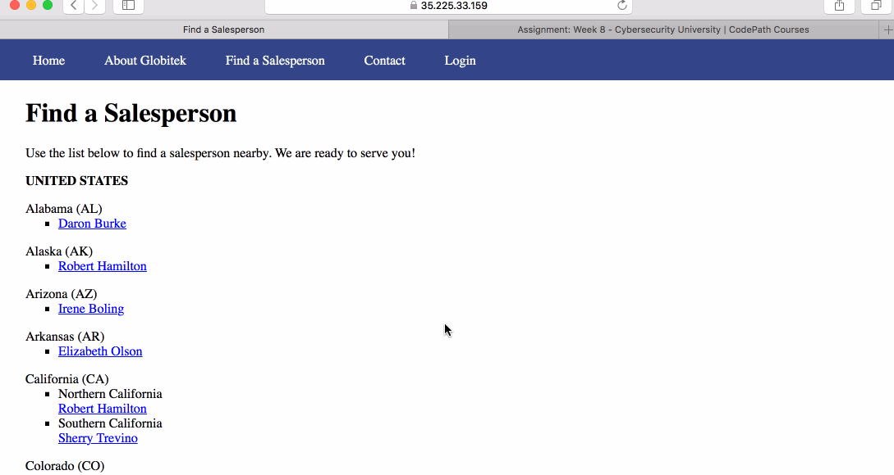
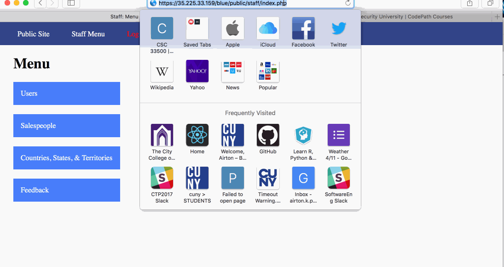
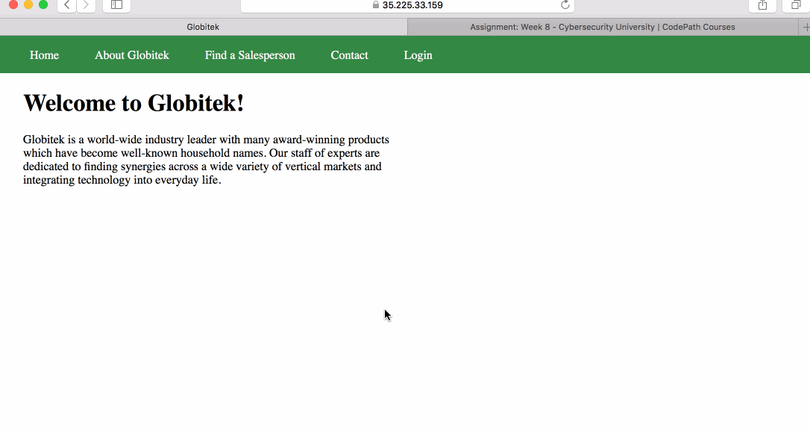
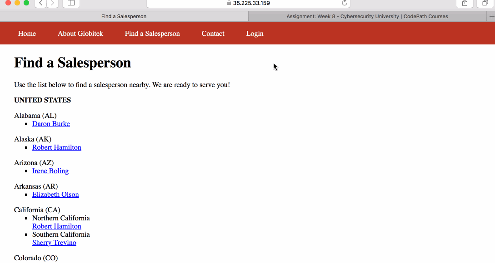
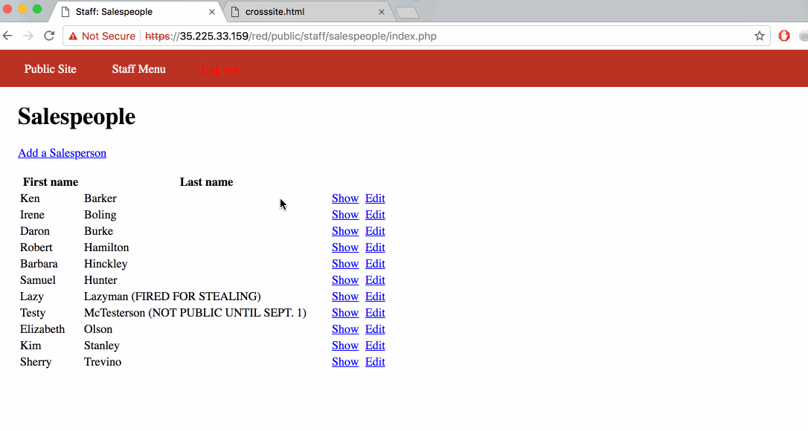

# Week8Project Project 8 - Pentesting Live Targets

Time spent: **6** hours spent in total

> Objective: Identify vulnerabilities in three different versions of the Globitek website: blue, green, and red.

The six possible exploits are:
* Username Enumeration
* Insecure Direct Object Reference (IDOR)
* SQL Injection (SQLi)
* Cross-Site Scripting (XSS)
* Cross-Site Request Forgery (CSRF)
* Session Hijacking/Fixation

Each version of the site has been given two of the six vulnerabilities. (In other words, all six of the exploits should be assignable to one of the sites.)

## Blue

Vulnerability #1: SQL Injection 
Can inject sql in the id parameter to make the website sleep/ have a delay.

Vulnerability #2: Session Hijacking/ Fixation 
Use the hacktool to change the PHPSESSID of someone that is logged in already so that the session will now be logged in.

## Green

Vulnerability #1: Cross-Site Scripting 
Inject code in the feedback that will be executed when someone goes to view the feedback

Vulnerability #2: Username Enumeration 
On the log in if the username exist and the log in is unsucessful the message will be bolded while if the username does not exist the message will not be bolded.

## Red

Vulnerability #1: Insecure Direct Object Reference 
Can change the id parameter to show people in the system that are not supposed to be shown.

Vulnerability #2: Cross-Site Request Forgery 
Create an html form that changes the person with the id=4 so when a logged in person goes to the malicious site the info will be changed while the website  shows nothing. 

## Notes

None
